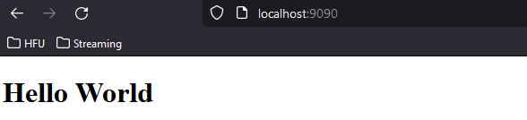
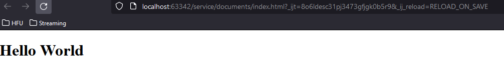
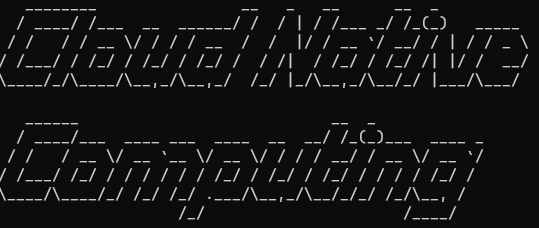
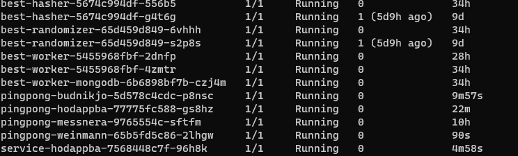
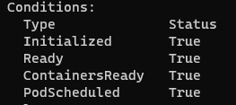
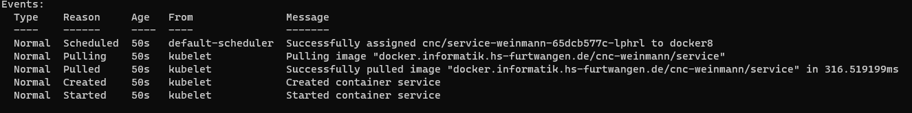
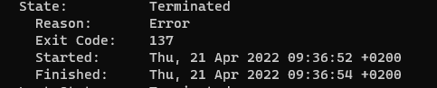
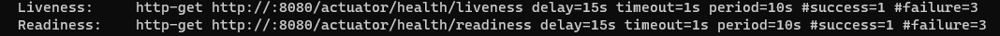
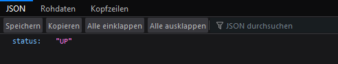

# Luca Weinmann 

## Praktikum 2

### Aufgabe 1

```bash
docker run ubuntu echo "Cloud Native Computing"
```

### Aufgabe 2

```bash
docker ps -a
docker start c050d
c050d
docker start c050d
c050d
docker logs c050d
Cloud Native Computing
Cloud Native Computing
Cloud Native Computing
```

### Aufgabe 3

```bash
docker rm c050d
```

### Aufgabe 4

```bash 
docker run -d -p 9090:80 nginxdemos/hello
```

Server Address: 172.17.0.2:80

### Aufgabe 5

```bash 
docker ps
docker stop 0baa
docker ps -a
docker rm 0baa
docker ps -a
```

### Aufgabe 6

im Verzeichnis documents/index.html

### Aufgabe 7

```bash 
docker run -d -v D:/WorkHFU/Master/CloudNativeComputing/Praktika/Praktikum_01_REST_Server/service/documents/:/usr/share/nginx/html -p 9090:80 nginx
```


<br>Die index.html auf Port 9090 aufgerufen


<br>Die index.html als lokale Datei aufgerufen

### Aufgabe 8

```bash 
docker ps
docker stop 2567
docker rm 2567
```

## Praktikum 3
### Schritt 1
```bash 
docker build -t ubuntu:figlet .
docker run ubuntu:figlet "Cloud Native Computing"
```


### Schritt 2
```bash 
docker login -u weinmann docker.informatik.hs-furtwangen.de
mvn compile jib:build -D"image=docker.informatik.hs-furtwangen.de/cnc-weinmann/service"
```

### Schritt 3


### Schritt 4
Port 8080 ist schon belegt
```bash
docker run -p 8090:8080 docker.informatik.hs-furtwangen.de/cnc-weinmann/service
```

### Schritt 5
Siehe GitLab

## Praktikum 4

### Aufgabe 1
Siehe Blatt

### Aufgabe 2
Siehe Blatt

### Aufgabe 3
```bash
kubectl config use-context luca.weinmann-kubernetes
kubectl config set-context --current --namespace=cnc
```

### Aufgabe 4
```bash
kubectl create deployment pingpong-weinmann --image=jpetazzo/ping --replicas 3
```

### Aufgabe 5
```bash
kubectl scale deployment pingpong-weinmann --replicas 1
```
 <br>

### Aufgabe 6
```bash
kubectl create deployment service-weinmann --image=docker.informatik.hs-furtwangen.de/cnc-weinmann/service --replicas 1
```

### Aufgabe 7
> IP: 10.244.10.13

Conditions: <br>
 <br>
Events: <br>


### Aufgabe 8
```bash
kubectl get deployments
kubectl delete deployment service-weinmann
```

## Praktikum 5
### Aufgabe 1
```bash
bubectl get deployments
kubectl delete deployments pingpong-weinmann
```
### Aufgabe 2
```bash
kubectl apply -f .\pod.yaml
kubectl get pods
kubectl delete pods service-weinmann
kubectl get pods
```
### Aufgabe 3
```bash
kubectl apply -f .\pod.yaml
kubectl describe pod service-weinmann
kubectl delete pods service-weinmann
```

### Aufgabe 4

```bash
kubectl delete pods service-weinmann
```

### Aufgabe 5
```bash
mvn compile jib:build -D"image=docker.informatik.hs-furtwangen.de/cnc-weinmann/service"
kubectl apply -f .\pod.yaml
kubectl get pods
kubectl describe pod service-weinmann
```


### Aufgabe 6
```bash
kubectl port-forward service-weinmann 8080:8080
```



## Praktikum 6

### Aufgabe 2
```bash
mvn compile jib:build -D"image=docker.informatik.hs-furtwangen.de/cnc-weinmann/service"
```

### Aufgabe 3
```bash
kubectl apply -f deployment.yaml
kubectl get pods
```

### Aufgabe 4
```bash
kubectl apply -f service.yaml
kubectl get services
kubectl port-forward service/service-weinmann 8080:80
```

### Aufgabe 5
```bash
kubectl apply -f ingress.yaml
kubectl get ingress
```
Rückgabewerte:
- service-weinmann-7b8fb9cbd-vprcs
- service-weinmann-7b8fb9cbd-ktwfl
- service-weinmann-7b8fb9cbd-x2jn4
- service-weinmann-7b8fb9cbd-vprcs
- service-weinmann-7b8fb9cbd-ktwfl

## Praktikum 7

### Aufgabe 1
```bash
mvn compile jib:build -D"image=docker.informatik.hs-furtwangen.de/cnc-weinmann/service"
kubectl delete pods -l author=weinmann
```

### Aufgabe 2
```bash
kubectl port-forward service/service-weinmann 8080:80
```

### Aufgabe 3
Davor noch die service.yaml Datei anpassen.
```bash
kubectl apply -f service.yaml
kubectl apply -f servicemonitor.yaml
```

### Aufgabe 4
```bash
mvn compile jib:build -D"image=docker.informatik.hs-furtwangen.de/cnc-weinmann/service"
kubectl delete pods -l author=weinmann
```

### Aufgabe 7
```bash
mvn compile jib:build -D"image=docker.informatik.hs-furtwangen.de/cnc-weinmann/service"
kubectl delete pods -l author=weinmann
kubectl logs -l author=weinmann
```

## Praktikum 8

### Aufgabe 1
```bash
kubectl delete serviceMonitor servicemonitor-weinmann
kubectl delete ingress ingress-weinmann
kubectl delete service service-weinmann
kubectl delete deployment service-weinmann
```

### Aufgabe 4
```bash
helm install service-weinmann src/charts/service
```

## Praktikum 9
### Aufgabe 1
```bash
mvn compile jib:build -D"image=docker.informatik.hs-furtwangen.de/cnc-weinmann/service"
helm delete service-weinmann
helm dependency update ./src/charts/service
helm install service-weinmann src/charts/service
```

### Aufgabe 2
```bash
helm repo add bitnami https://charts.bitnami.com/bitnami
skaffold dev
```

## Praktikum 10
Löschen für das neue Deployment
```bash
kubectl delete serviceMonitor servicemonitor-weinmann
kubectl delete ingress ingress-weinmann
kubectl delete service service-weinmann
kubectl delete deployment service-weinmann
```

```bash 
mvn compile jib:build -D"image=docker.informatik.hs-furtwangen.de/cnc-weinmann/service"
helm delete service-weinmann
helm dependency update ./src/charts/service
helm install service-weinmann src/charts/service
```