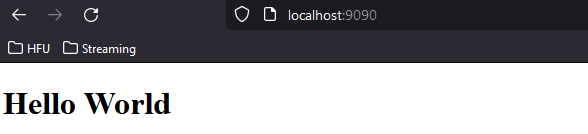
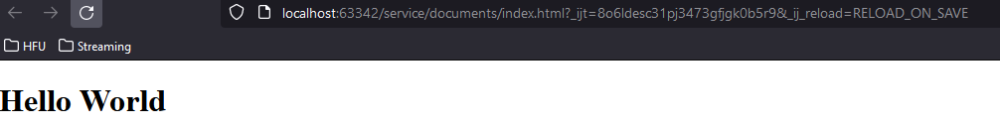

# Luca Weinmann

## Praktikum 1

### Aufgabe 1

```bash
docker run ubuntu echo "Cloud Native Computing"
```

### Aufgabe 2

```bash
docker ps -a
docker start c050d
c050d
docker start c050d
c050d
docker logs c050d
Cloud Native Computing
Cloud Native Computing
Cloud Native Computing
```

### Aufgabe 3

```bash
docker rm c050d
```

### Aufgabe 4

```bash 
docker run -d -p 9090:80 nginxdemos/hello
```

Server Address: 172.17.0.2:80

### Aufgabe 5

```bash 
docker ps
docker stop 0baa
docker ps -a
docker rm 0baa
docker ps -a
```

### Aufgabe 6

im Verzeichnis documents/index.html

### Aufgabe 7

```bash 
docker run -d -v D:/WorkHFU/Master/CloudNativeComputing/Praktika/Praktikum_01_REST_Server/service/documents/:/usr/share/nginx/html -p 9090:80 nginx
```


<br>Die index.html auf Port 9090 aufgerufen


<br>Die index.html als lokale Datei aufgerufen

### Aufgabe 8

```bash 
docker ps
docker stop 2567
docker rm 2567
```